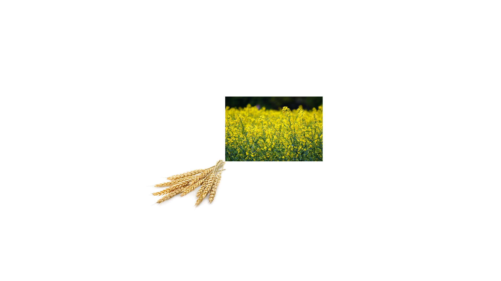
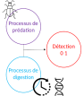

name: intro

<!-- F1D763 -->
<!-- F7A913 -->
<!-- C94326 -->
<!-- 1F908E -->
<!-- 33658A -->


```{r setup, include = FALSE,  eval = TRUE}
library('RefManageR')
main_dir <-  '..'
common_img_dir <- file.path(main_dir,'courses_tools','resources', 'common_figs')
course_img_dir <- file.path(main_dir,'resources', 'figs')
BibOptions(check.entries = FALSE,
           bib.style = "authoryear",
           cite.style = "authoryear",
           style = "markdown",
           hyperlink = TRUE,
           max.names = 3,
           longnamesfirst= FALSE, 
           dashed = TRUE)
myBib <- ReadBib('biblio.bib', check = FALSE)
```

```{r xaringan-fit-screen, echo=FALSE}
xaringanExtra::use_fit_screen()
```


# Contexte général en agroécologie

--
##  Les carabes 

<figure>
  
</figure>

---
# Contexte général en agroécologie

##  Les carabes 

<figure>
  
</figure>

---
# Contexte général en agroécologie

##  Les carabes 

<figure>
  
</figure>

---
# Contexte général en agroécologie

##  Les carabes 

<figure>
  
</figure>

---
# Contexte général en agroécologie

##  Les carabes 

* Des alliés dans la lutte biologique pour la préservation des cultures : prédateurs de pucerons, limaces `r Citep(myBib,c('symondson2004coleoptera'))`

* Mais les carabes forment une grande famille 
  
    * certains membres de la famille préfèrent des auxiliaires des cultures comme les vers de terre ou les araignées `r Citep(myBib,c('king2010prey'))`

   * Des études en milieu contrôlé mais peu d'études aux champs sur l'impact réel des communautés de carabes

--

.care[Quantifier l'impact des différentes sortes de carabes sur différents alliés ou ravageurs de cultures]


---

# Contexte général en recherche

<figure>
  
</figure>


---

# Contexte général en recherche

<figure>
  
</figure>


---

# Contexte général en recherche

<figure>
  
</figure>


---

# Contexte général en recherche

<figure>
  
</figure>


.care[Le directeur ou la directrice est t il/elle un frein ou une aide au doctorant ? ]

---
# Contexte général en agroécologie

##  Les carabes 

<figure>
  
</figure>


.care[Quantifier l'impact des différentes sortes de carabes sur différents alliés ou ravageurs de cultures]

---
# Contexte général en agroécologie

## L'aide de la biologie moléculaire 

 Séquençage du contenu stomacal : présence / absence des proies 

--

## Le problème de la digestion

* Les traces de proies ne sont visibles tant qu'elles ne sont pas digérées, processus de digestion inconnu


<figure>
  
</figure>

---
# Les données

.pull-left[
## Carabes prélevés en milieu agricole
.pred[Prédation] + .digest[Digestion]

*   Des carabes prélevés aux champs (échantillonnage aléatoire)
*  Diagnostique PCR multiplex

]

.pull-right[
## Carabes en laboratoire
 .digest[Digestion]

*   Affamés, on leur fournit un unique type de proies
*  Diagnostique PCR multiplex
*  Diagnostique PCR multiplex
*  Analyse à différents temps

]


---
name:model
# Un modèle intégré

--
## Modèle de prédation pour un couple proie-carabe

* Un processus de Processus de Poisson homogène d'intensité  $\lambda_{pc}$


---
template:model

## Modèle de prédation pour un couple proie-carabe

* Un processus de Processus de Poisson homogène d'intensité  $\lambda_{pc}$


---
template:model

## Modèle de prédation pour un couple proie-carabe

* Un processus de Processus de Poisson homogène d'intensité  $\lambda_{pc}$ avec digestion


--

Les évènements de prédation détectable sont un PP inhomogène d'intensité 

$$\mu_{pc}(t) = \lambda_{pc} \frac{e^{\beta_0^{bc}- \beta_1^{bc} t}}{1 + e^{\beta_0^{pc} - \beta_1^{pc} t}}.$$


## Modèle d'observation

L'observation est une présence ou absence pour chaque type de proies 

$$Y_{cpk} \sim \mathcal{B}(p_{cp}), \quad p_{cp} = 1- \int_0^{+\infty} \mu_{pc}(t) dt.$$

---
template:model

## Modèle pour les données de laboratoires

Pour chaque temps $t$, on note si la proie est encore visible, on a donc une simple régression logistique

$$Z_{cpk} \sim \mathcal{B}(p_{cpk}), \quad logit(p_{cpk}) =  \beta^{pc}_0 -\beta^{pc}_1 t_{cpk}$$


---
template:model


---
# Résultats 

## sur les ravageurs 


---
# Résultats 

## sur les auxiliaires 


---
# Perspectives 


* Intégrer les données de fluorescence de la biologie moléculaire directement (seuil pour 0/1 difficile à déterminer)

* Prendre en compte un comportement nocture/diurne

* Coupler avec des mesures d'abondance des différentes proies aux champs 

--

## Une autre perspective enthousiasmante : les recontres R à Avignon su 21 au 23 juin
 
.left-column[]
.right-column[]


---
# Des photos pour finir 

Âmes sensibles s'abstenir, des animaux ont souffert pour obtenir ces images

--

.pull-left[

]


.pull-left[

]


---
class: biblio
count: false
# Bibliography


```{r refs_3, echo=FALSE, results="asis", eval = TRUE, cache = FALSE}
PrintBibliography(myBib)
```

